# 통합 심층 분석 및 개선안 (데이터 파이프라인, 모델링, 프론트엔드, UX/UI)

# [Agent 1: 데이터 엔지니어 페르소나] 데이터 파이프라인 심층 분석 및 개선안

## 1. 현재 데이터 파이프라인 설명 및 구조적 한계 (비판)

현재 `ICB10_project2_consolidated` 폴더 내의 데이터 아키텍처는 주로 `data/` 폴더의 CSV 및 SQLite DB 파일과 `src/naver_api/`의 수집 스크립트들로 구성되어 있습니다. 데이터를 정적으로 파일 형태로 관리하며, 스케줄러 기반의 자동화 파이프라인이 부재한 상태입니다.

### 1-1. 현행 데이터 흐름도 (As-Is)
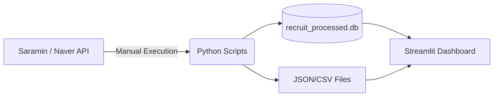

**비판점**: 데이터의 갱신이 수동으로 이루어지며, 크롤러 실패 시 재시도 로직이나 데드 레터 큐(Dead Letter Queue)가 없어 유실 위험이 높습니다.

### 1-2. 데이터베이스 스키마 및 결합도 비판
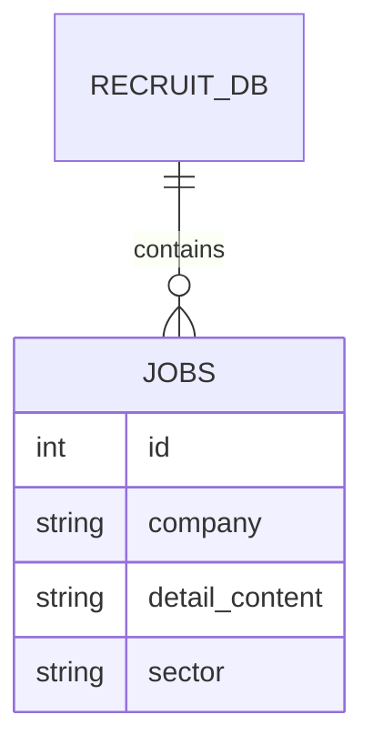
**비판점**: 데이터베이스가 정규화되지 않은 통짜 테이블(Flat table) 구조를 지니고 있어, 직무 카테고리나 기업 정보 변경 시 이상 현상(Anomaly)이 발생할 수 있습니다.

---

## 2. 데이터 엔지니어링 관점의 10대 개선안 및 시각화

### 개선안 1: Airflow 기반의 배치 자동화 도입
수동 파이프라인을 Airflow DAG로 변환하여 매일 새벽 정해진 시간에 데이터를 갱신합니다.
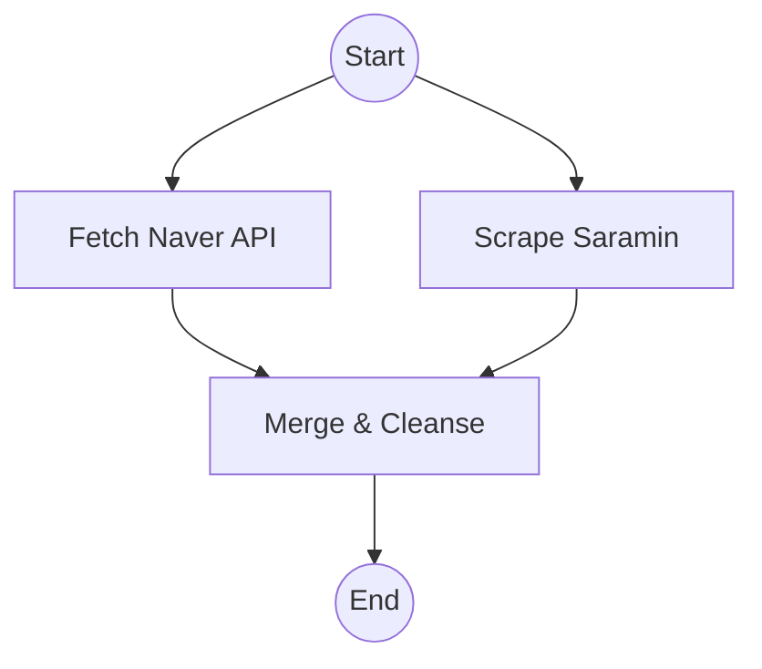

### 개선안 2: 데이터 정규화 및 ERD 재설계
기업 테이블과 채용 공고 테이블을 분리하여 무결성을 확보합니다.
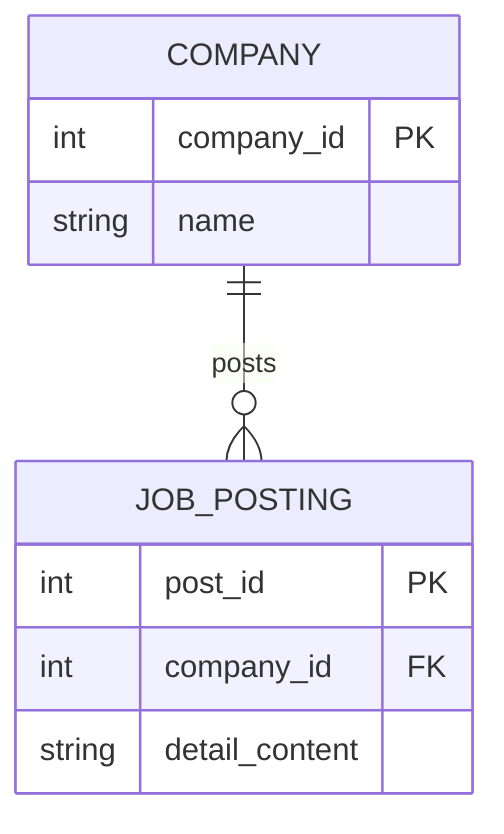

### 개선안 3: 에러 핸들링 및 재시도(Retry) 메커니즘 구축
API Rate Limit이나 네트워크 오류에 대응하기 위해 백오프(Backoff) 알고리즘을 도입합니다.
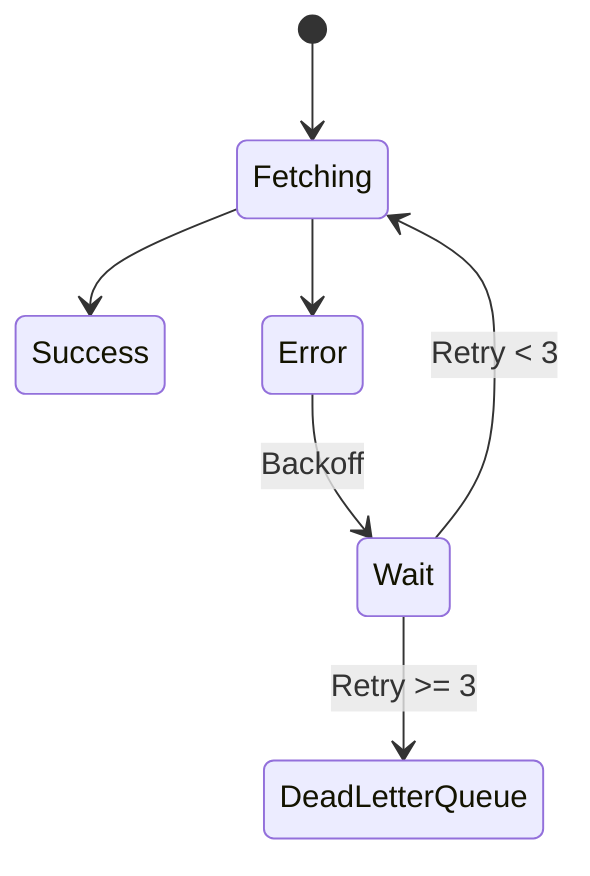

### 개선안 4: Delta Lake / 파케이(Parquet) 포맷 도입
CSV 대신 파케이 압축 포맷을 사용하여 I/O 병목을 해결하고 읽기 속도를 높입니다.
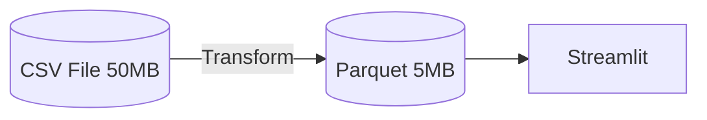

### 개선안 5: 데이터 정합성 검증(Data Quality Check) 파이프라인
데이터 적재 전 null 값 비율, 타입 일치 여부를 검사하는 Great Expectations 룰을 추가합니다.
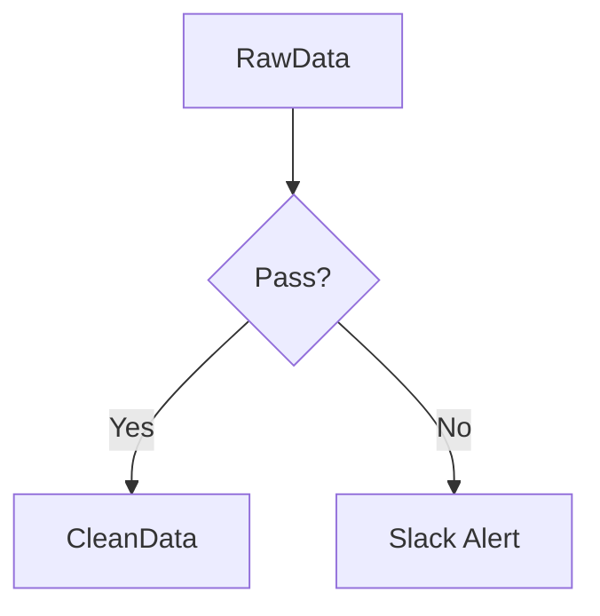

### 개선안 6: 스트리밍 아키텍처(Kafka) 도입 검토 (장기)
실시간 채용 공고 알림을 위해 Kafka를 통한 이벤트 드리븐 아키텍처를 구성합니다.
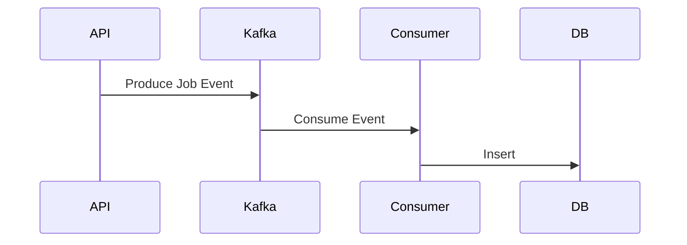

### 개선안 7: 메타데이터 관리 시스템 연동
컬럼의 정의, 소스, 갱신 주기를 관리하는 Data Catalog(예: Amundsen)를 연결합니다.
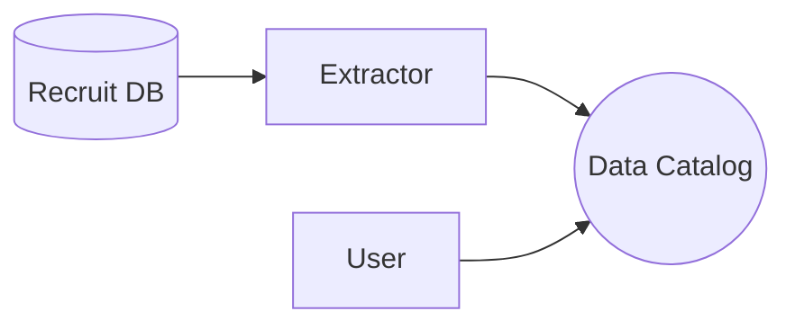

### 개선안 8: 병렬 처리(Multiprocessing)를 통한 크롤링 속도 향상
단일 스레드 크롤러를 비동기(Asyncio) 또는 멀티프로세싱 기반으로 개편합니다.
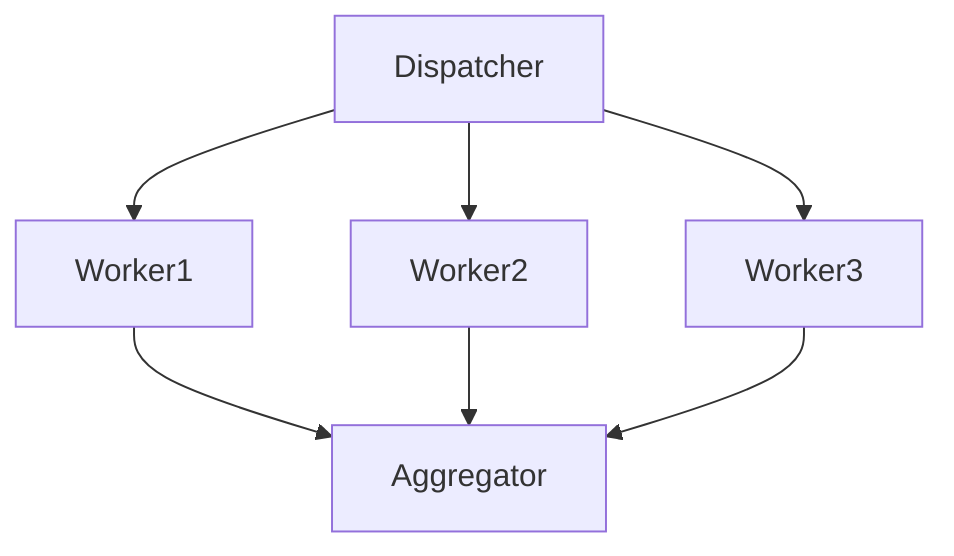

### 개선안 9: CI/CD를 통한 데이터 파이프라인 배포
파이프라인 코드 변경 시 자동 테스트 및 배포가 이루어지는 GitHub Actions 환경 구축.
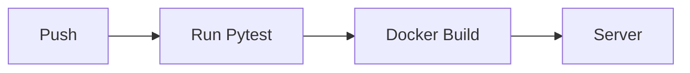

### 개선안 10: To-Be 마스터 데이터 아키텍처
최종적으로 클라우드(AWS/GCP) 기반의 모던 데이터 스택을 구성합니다.
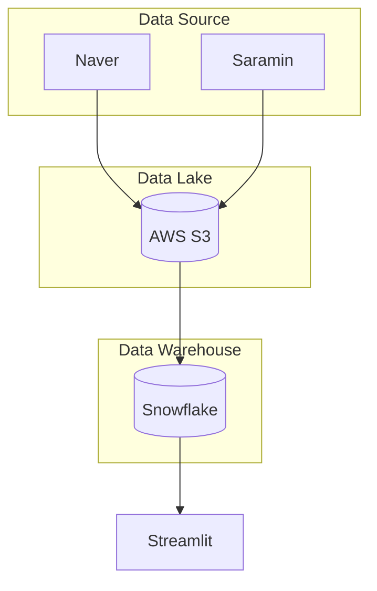

---

# [Agent 2: 데이터 분석가 페르소나] 데이터 분석 및 모델링 심층 분석 및 개선안

## 1. 현재 데이터 분석 및 모델링 설명 및 방법론적 한계 (비판)

현재 `src/eda_*.py` 및 모델링 아키텍처는 TF-IDF를 이용한 키워드 추출과 기초적인 빈도 분석에 의존하고 있습니다. 대시보드에서 제공되는 인사이트는 주로 규칙 기반(Rule-based) 매칭과 단순 통계(EDA) 결과입니다.

### 1-1. 현행 텍스트 마이닝 흐름도 (As-Is)
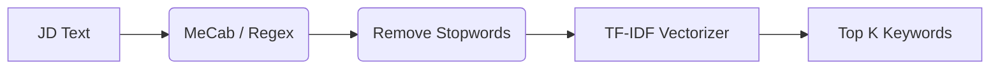

**비판점**: 단어의 문맥적 의미를 파악하지 못하는 BoW(Bag of Words) 기반 모델이므로, '디자인'과 'UI/UX'를 전혀 다른 스킬로 인식하는 치명적인 한계가 있습니다.

### 1-2. 현재 자가진단 스코어링 로직 비판
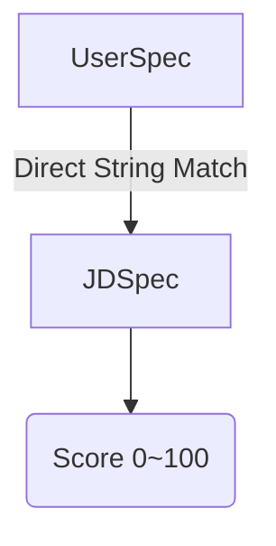
**비판점**: 사용자가 'Figma'라고 적고, 공고에 '피그마'라고 적혀있으면 0점으로 처리되는 하드코딩된 동의어 사전에 너무 크게 의존합니다.

---

## 2. 데이터 분석 및 모델링 관점의 10대 개선안 및 시각화

### 개선안 1: 문맥 기반 임베딩(Sentence Transformer) 전면 도입
TF-IDF를 버리고 SBERT 등 사전학습된 언어 모델을 통해 의미적 유사도를 측정해야 합니다.
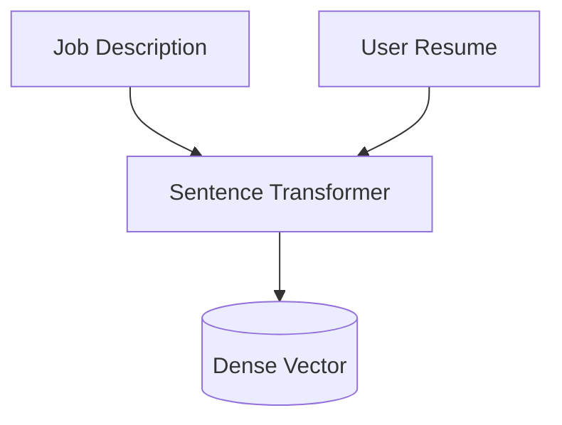

### 개선안 2: 벡터 DB를 활용한 시맨틱 검색(Semantic Search)
FAISS나 Pinecone을 도입하여 고속으로 유사 공고를 탐색합니다.
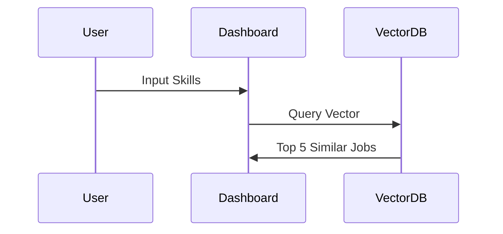

### 개선안 3: UMAP 기반 직무 군집화 (Clustering) 시각화
직무 간의 경계를 2D 평면에 투사하여 이직 가능한 유관 직무를 탐색하도록 돕습니다.
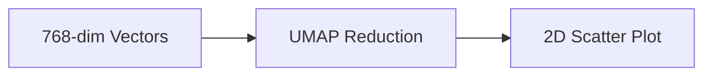

### 개선안 4: LLM 기반의 JD 요약 및 키워드 추출 (Zero-shot)
단순 형태소 분석 대신 LLM API(OpenAI/Claude)를 사용해 정확한 '핵심 역량'만 추출합니다.
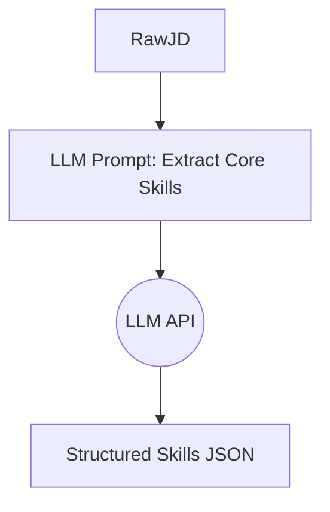

### 개선안 5: 협업 필터링(Collaborative Filtering) 도입 (구직자 탭)
콘텐츠 기반 추천을 넘어, '이 공고를 본 다른 구직자들이 많이 본 공고'를 추천합니다.
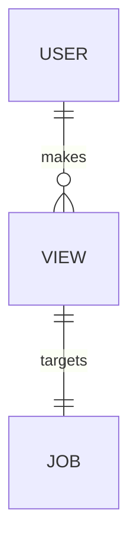

### 개선안 6: 동의어 자동 확장(Synonym Expansion) 모델
Word2Vec이나 FastText를 로컬에 구축하여 동의어를 자동으로 매핑합니다.
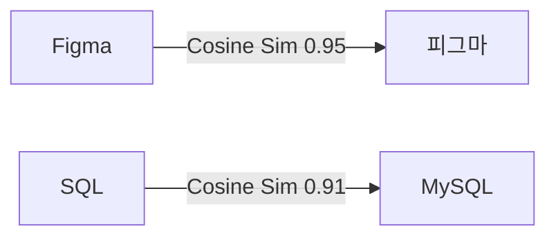

### 개선안 7: 토픽 모델링(LDA / BERTopic)으로 트렌드 도출
단순 키워드 빈도가 아닌, 시간에 따른 채용 트렌드 주제(Topic)의 변화를 포착합니다.
```mermaid
flowchart TD
    Docs --> BERTopic
    BERTopic --> Topic1(AI/ML)
    BERTopic --> Topic2(Web Dev)
```

### 개선안 8: A/B 테스트 환경 구축 (추천 알고리즘 평가)
대시보드 추천의 정확도를 측정하기 위해 모델 A(TF-IDF)와 모델 B(SBERT)를 분리합니다.
```mermaid
flowchart LR
    User --> Splitter{Traffic Split}
    Splitter -->|50%| ModelA[TF-IDF]
    Splitter -->|50%| ModelB[SBERT]
```

### 개선안 9: 시계열 예측 모델(Prophet/ARIMA) 적용
네이버 API 데이터를 기반으로 다음 달의 특정 기술 스택 수요를 예측합니다.
```mermaid
flowchart LR
    PastData[Time Series Data] --> Prophet[Prophet Model]
    Prophet --> Forecast[Next 30 Days Trend]
```

### 개선안 10: To-Be 통합 머신러닝 파이프라인
데이터 수집부터 모델 재학습, 서빙까지 MLflow 기반의 통합 파이프라인을 설계합니다.
```mermaid
flowchart TD
    subgraph Data
        Raw --> Processed
    end
    subgraph ML
        Processed --> Train[Model Training]
        Train --> Registry[(Model Registry)]
    end
    subgraph Serving
        Registry --> API[FastAPI Serving]
    end
```

---

# [Agent 3: 프론트엔드 엔지니어 페르소나] 프론트엔드 아키텍처 심층 분석 및 개선안

## 1. 현재 대시보드(Frontend) 아키텍처 설명 및 UX/UI 한계 (비판)

현재 `report/dashboard_consolidated_mock.py`는 2,600줄이 넘는 방대한 모놀리식(Monolithic) 코드로 구성되어 있습니다. 직무 렌더링 로직, 그래프 도출 로직, CSS 스타일링 로직이 모두 한 파일에 섞여 있어 유지보수가 매우 어렵습니다.

### 1-1. 현행 대시보드 컴포넌트 결합도 비판 (As-Is)
```mermaid
flowchart TD
    App[app.py] --> Config(st.set_page_config)
    App --> DataLoad(Data Loading / SQL)
    App --> Logic(TF-IDF / Metrics)
    App --> UI(Tabs Rendering)
```

**비판점**: 하나의 파이썬 파일이 DB 커넥션, 모델 추론, UI 렌더링을 모두 담당하고 있어, 화면 갱신(Re-run) 시 무거운 백엔드 로직이 불필요하게 재실행되는 성능 저하 현상이 발생합니다.

### 1-2. 상태 관리(Session State)의 부재
```mermaid
stateDiagram-v2
    [*] --> PageLoad
    PageLoad --> SelectJob
    SelectJob --> ReRunWholeApp
    ReRunWholeApp --> PageLoad
```
**비판점**: 사용자가 콤보박스나 탭을 클릭할 때마다 전체 앱이 새로고침되며, 이전 사용자의 입력 상태(State)가 휘발되는 등 Streamlit의 `st.session_state`를 제대로 활용하지 못하고 있습니다.

---

## 2. 프론트엔드 및 UX/UI 관점의 10대 개선안 및 시각화

### 개선안 1: 모놀리식 코드의 컴포넌트화 (Refactoring)
데이터 로드, 비즈니스 로직, UI 렌더링을 개별 모듈로 분리하여 응집도를 높입니다.
```mermaid
flowchart TD
    Main[main.py] --> Data[utils/data_loader.py]
    Main --> Logic[utils/metrics.py]
    Main --> Components[components/tabs.py]
```

### 개선안 2: Session State를 활용한 상태 유지 (State Management)
직무 필터나 입력한 스펙이 페이지 이동 후에도 유지되도록 세션 상태를 도입합니다.
```mermaid
stateDiagram-v2
    state "st.session_state" as SS
    UserAction --> SS : Update key
    SS --> UIRender : Read key
```

### 개선안 3: @st.cache_data를 이용한 렌더링 최적화
DB 쿼리와 무거운 데이터프레임 처리를 캐싱하여 UI 반응 속도를 극대화합니다.
```mermaid
flowchart LR
    Request --> Cache{Is Cached?}
    Cache -->|Yes| FastReturn[Return Instant]
    Cache -->|No| DBQuery[Execute Slow SQL]
    DBQuery --> Cache
```

### 개선안 4: 반응형(Responsive) 레이아웃 적용
모바일 사용자나 좁은 해상도를 고려하여 `st.columns`를 유동적으로 설계합니다.
```mermaid
graph TD
    Desktop --> |3 Columns| Layout[Metric 1, Metric 2, Metric 3]
    Mobile --> |1 Column Stack| Layout
```

### 개선안 5: 다크 모드 / 라이트 모드 동적 테마 지원
하드코딩된 CSS 대신 Streamlit 기본 Theme 설정(config.toml)을 활용하여 테마 일관성을 유지합니다.
```mermaid
flowchart LR
    UserToggle --> Config[config.toml]
    Config --> |Primary Color| UIComponents
    Config --> |Background Color| Layout
```

### 개선안 6: 사용자 여정(User Journey) 간소화
메인 탭이 4개나 되어 복잡하므로, '요약 대시보드'와 '상세 리포트' 투트랙으로 UI 구조를 개편합니다.
```mermaid
journey
    title 구직자 사용자 여정
    section 스펙 진단
      기본 정보 입력: 5: User
      진단 결과 확인: 4: System
    section 공고 추천
      맞춤 공고 리스트 클릭: 5: User
      상세 공고로 이동: 5: System
```

### 개선안 7: Plotly 차트 인터랙티비티 강화
단순 정적 이미지가 아닌, 줌인/줌아웃 및 Tooltip Hover 기능을 100% 활용하는 Plotly 템플릿을 설정합니다.
```mermaid
graph TD
    Hover --> Tooltip[Show JD Count, Company Name]
    Click --> DrillDown[Show Details Table]
```

### 개선안 8: Asynchronous 데이터 로딩 (Spinner 활용)
무거운 데이터를 가져올 때 빈 화면 대신 `st.spinner`나 `st.progress` 바를 제공하여 UX를 향상시킵니다.
```mermaid
sequenceDiagram
    User->>UI: Click "Run Analysis"
    UI->>State: Show Spinner
    State->>Backend: Fetch Data
    Backend-->>State: Data Ready
    State->>UI: Render Charts & Hide Spinner
```

### 개선안 9: 무한 스크롤 / 페이지네이션(Pagination) 도입
채용 공고나 관련 키워드가 100개가 넘을 경우 스크롤을 무한히 내려야 하는 문제를 해결합니다.
```mermaid
flowchart TD
    Page1[Items 1-10] --> Button[Next Page]
    Button --> Page2[Items 11-20]
```

### 개선안 10: To-Be 프론트엔드 아키텍처 (장기 - React/Next.js 전환)
Streamlit의 한계를 극복하기 위해 향후 프론트엔드 프레임워크와 FastAPI를 결합한 분산 아키텍처로 진화합니다.
```mermaid
flowchart TD
    subgraph Frontend
        NextJS[Next.js App]
    end
    subgraph Backend
        FastAPI[FastAPI Server]
    end
    subgraph Services
        RecommendationEngine[Recommendation Logic]
    end
    NextJS <-->|REST API| FastAPI
    FastAPI <--> RecommendationEngine
```

---

# [Agent 4: UX/UI 및 시각디자인 전문가 페르소나] 타이포그래피 및 시각 디자인 심층 분석 및 개선안

## 1. 디자인 및 타이포그래피 비판 (Antipatterns)

현재 대시보드는 Streamlit이 제공하는 기본 UI에 크게 의존하여, 시각적 계층 구조가 불명확하고 가독성 측면에서 많은 안티패턴을 노출하고 있습니다.

- **비판점 1 (타이포그래피 및 폰트 체계)**: 명확한 Heading(H1~H6) 스케일이나 행간(Line-height) 규칙이 부재하여 정보 가독성이 떨어지며, 브랜드 아이덴티티를 나타내는 폰트 시스템이 결여되어 있습니다.
- **비판점 2 (시각적 계층 구조)**: 모든 컴포넌트가 동일한 여백과 그림자(Shadow)를 가져, 사용자가 먼저 봐야 할 중요한 정보(핵심 지표)와 부차적 정보 간의 Visual Hierarchy가 붕괴되어 있습니다.
- **비판점 3 (색상 대비 및 접근성)**: 특정 배지나 에러/경고 메시지에서 배경색과 글자색의 명도 대비(Contrast Ratio)가 웹 접근성 표준(WCAG) 4.5:1을 충족하지 못해 시각적 피로를 유발합니다.

### 1-1. 현재 타이포그래피 안티패턴
```mermaid
flowchart TD
    A[Hardcoded Font Sizes] --> B[Inconsistent Margins & Line Heights]
    B --> C[Poor Readability]
    C --> D[High Cognitive Load for Users]
```

### 1-2. 붕괴된 시각적 계층 구조 (Visual Hierarchy)
```mermaid
graph TD
    Dashboard --> Filter[Filter Area: Same Visual Weight]
    Dashboard --> MainMetric[Metric Area: Same Visual Weight]
    Filter -.-> NoEmphasis[Attention Diluted]
    MainMetric -.-> NoEmphasis
```

---

## 2. 시각 디자인 관점의 10대 개선안 및 시각화 (Mermaid)

### 개선안 1: 체계적인 타이포그래피 스케일 구축
Base size(16px)를 기준으로 1.25 배율(Major Third) 스케일을 적용하여 텍스트의 위계를 명확히 하고, 프리미엄 폰트(Inter, Pretendard 등)를 도입합니다.
```mermaid
graph TD
    Base[Base Body: 16px / 1rem] --> H3[H3 Title: 25px / 1.56rem]
    H3 --> H2[H2 Title: 31px / 1.95rem]
    H2 --> H1[H1 Title: 39px / 2.44rem]
```

### 개선안 2: Bento Grid 레이아웃 고도화
단조로운 Row/Col 배치를 넘어, 주요 지표와 부가 정보의 중요도에 따라 격자 크기를 비대칭적으로 배분하는 트렌디한 Bento Grid 디자인을 적용합니다.
```mermaid
pie
    title Bento Grid Area Allocation (Visual Weight)
    "Main KPI Focus" : 50
    "Trend Chart Context" : 30
    "Filters Info Sub" : 20
```

### 개선안 3: 파스텔 배지(Badge) 시스템 도입
원색 위주의 상태 표시(Warning, Error) 대신 눈이 편안한 파스텔 톤 배경과 짙은 텍스트 명도를 조합하여 모던한 배지 시스템을 구축합니다.
```mermaid
flowchart LR
    Success[#E6F4EA Background] --> SText[#137333 Text]
    Warning[#FEF7E0 Background] --> WText[#B06000 Text]
    Error[#FCE8E6 Background] --> EText[#C5221F Text]
```

### 개선안 4: 반응형 여백(Responsive Spacing) 시스템 적용
8pt 그리드 시스템을 도입하여 모바일(4px, 8px)과 데스크톱(16px, 24px, 32px)의 여백(Margin/Padding)을 일관성 있게 스케일링합니다.
```mermaid
graph LR
    Micro[4px / 8px] --> Small[16px]
    Small --> Medium[24px / 32px]
    Medium --> Large[64px]
```

### 개선안 5: 다크/라이트 모드 최적화 컬러 팔레트 구축
배경, 카드, 텍스트(Primary, Secondary)의 색상을 다크모드와 라이트모드 양방향으로 완벽하게 매핑하는 시맨틱 컬러 변수를 설정합니다.
```mermaid
graph TD
    ThemeToggle{Current Theme} --> |Light| LightBase[bg-white, text-gray-900]
    ThemeToggle --> |Dark| DarkBase[bg-gray-800, text-gray-100]
    LightBase --> UIComponents[Card, Text, Button]
    DarkBase --> UIComponents
```

### 개선안 6: 시각적 정보 계층 트리(Visual Hierarchy Tree) 재정립
가장 시선이 먼저 가는 좌측 상단(F-Pattern)에 핵심 KPI를 배치하고, 디테일한 데이터 표는 하단에 배치하여 인지 흐름을 자연스럽게 유도합니다.
```mermaid
graph TD
    TopLeft[1. Global Filters] --> TopRight[2. Key Metrics & Scores]
    TopRight --> Middle[3. Visual Charts / Insights]
    Middle --> Bottom[4. Detailed Data Table]
```

### 개선안 7: Before/After 와이어프레임 흐름 개선
기존의 수직 스크롤 지옥(Before)에서, 탭과 아코디언을 활용한 '점진적 정보 노출(Progressive Disclosure)' 방식으로 와이어프레임을 개선합니다.
```mermaid
flowchart LR
    subgraph Before
        Scroll[Endless Vertical Scroll]
    end
    subgraph After
        Tabs[Tabs & Accordions] --> CleanView[Focused Content Area]
    end
    Before -->|Redesign UI| After
```

### 개선안 8: 유저 인터랙션 플로우(Micro-interaction) 추가
버튼 호버(Hover), 탭 전환 시 부드러운 전환 효과(Transition)와 시각적 피드백을 주어 프리미엄 UX를 제공합니다.
```mermaid
stateDiagram-v2
    [*] --> DefaultState
    DefaultState --> HoverState : cursor enter Add shadow/color shift
    HoverState --> ActiveState : click Scale down 0.98
    ActiveState --> DefaultState : release
```

### 개선안 9: 데이터 잉크 비율(Data-Ink Ratio) 극대화
차트의 불필요한 테두리, 배경선(Grid lines)을 제거하고 데이터 본연의 트렌드와 인사이트에만 집중하게 하는 미니멀리즘 시각화를 적용합니다.
```mermaid
flowchart TD
    RawChart --> RemoveBorders[Remove Borders & Backgrounds]
    RemoveBorders --> LightenGrid[Lighten / Remove Grid Lines]
    LightenGrid --> HighlightData[Highlight Target Data Line]
```

### 개선안 10: 여백(White Space)을 활용한 그룹핑 강화
관련된 정보 컴포넌트 사이의 간격(Proximity)을 좁히고, 무관한 컴포넌트 사이의 간격을 넓혀 시각적으로 논리적인 게슈탈트(Gestalt) 그룹을 형성합니다.
```mermaid
graph LR
    GroupA[Component 1 + Component 2] --- |Large White Space Spacing| GroupB[Component 3 + Component 4]
    style GroupA fill:#f4f4f5,stroke:#a1a1aa,stroke-width:2px,color:#000
    style GroupB fill:#e0e7ff,stroke:#818cf8,stroke-width:2px,color:#000
```
