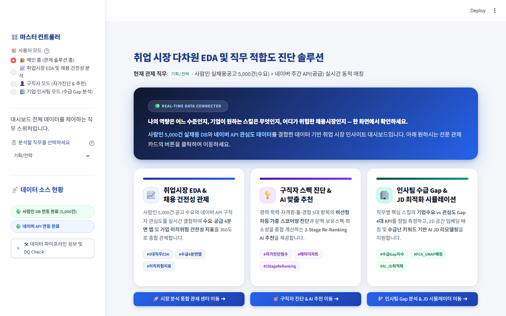
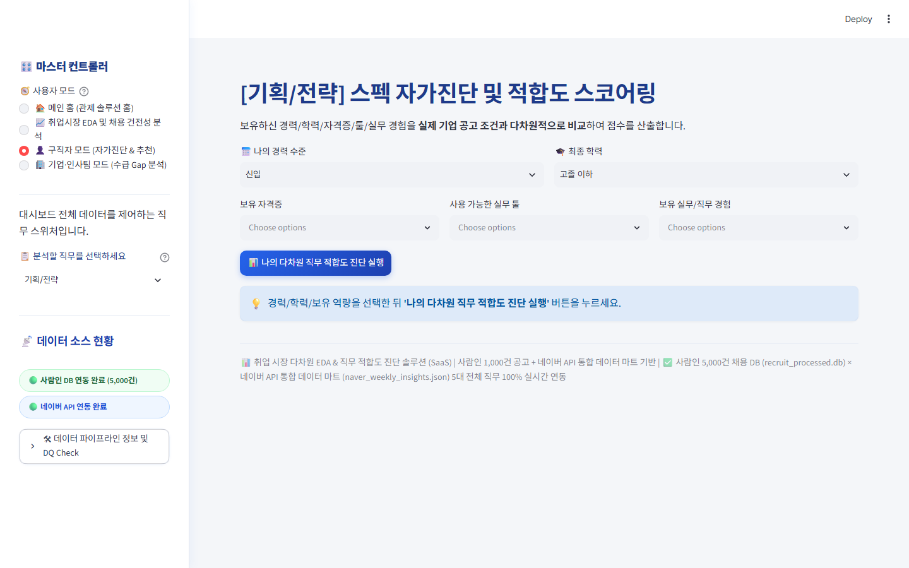
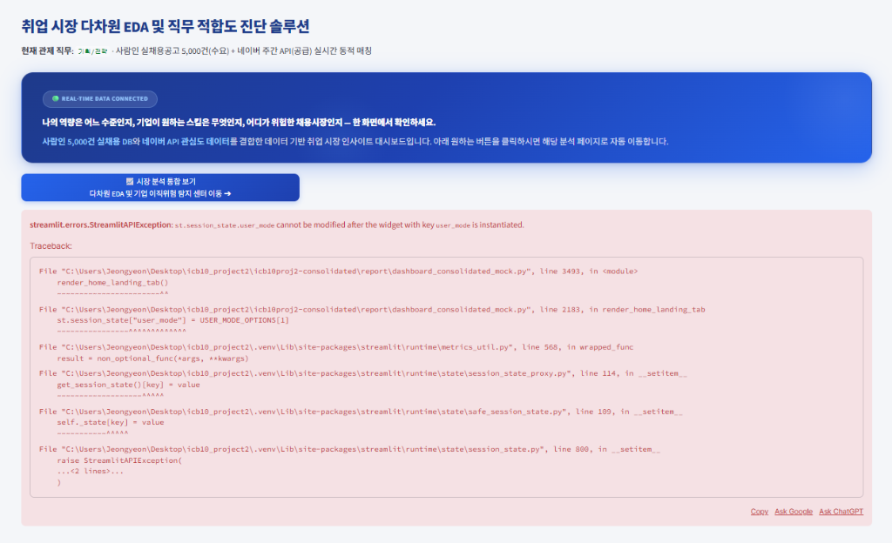

<!-- ═══════════════════════════════════════════════════════ -->
<!-- 1. 표지 -->
<!-- ═══════════════════════════════════════════════════════ -->
<!-- _class: cover -->

# 취업 시장 다차원 EDA & 직무 적합도 진단 솔루션

## B2B SaaS 대시보드 — 채용 수급 미스매치 해소 프로젝트

  📅 2026.08 &ensp;|&ensp; 👥 AI Data Analysis Team &ensp;|&ensp; 🛠️ Streamlit · Python · Plotly · SQLite

---

<!-- ═══════════════════════════════════════════════════════ -->
<!-- 1. 문제정의 & 초기 가설 -->
<!-- ═══════════════════════════════════════════════════════ -->

# 1. 문제정의 & 초기 가설

## 채용 시장의 영원한 역설: "기업은 공고를 올리지만, 쓸 사람이 없다"

채용 시장 양측 모두 수많은 채용 정보와 이력서를 축적하고 있으나, <strong>[구직자 보유 스펙] vs [기업 요구 역량]</strong> 간의 정량적 격차가 심화되는 <strong>정보 비대칭 문제</strong>를 해결하고자 했습니다.

구직자 관점
<h3>스펙을 갖춰도 서류 합격이 어려운 이유</h3>
<ul>
<li>자격증 및 어학 성적을 올려도 <strong>서류 합격률 둔화</strong></li>
<li>정확히 어떤 실무 툴을 익혀야 하는지 <strong>객관적 기준 부재</strong></li>
<li>직무별 요구 스킬 우선순위 판단의 어려움</li>
</ul>

기업 / 인사팀 관점
<h3>지원자는 많은데 직무 적합자가 없다</h3>
<ul>
<li>JD에 모호한 우대사항 나열 → <strong>허수 지원자 쏠림</strong></li>
<li>실무에 필요한 핵심 분석 역량자는 <strong>정작 부족</strong></li>
<li>반복 채용 공고 게재로 채용 소모전 및 시간/비용 낭비 발생</li>
</ul>

초기 가설 H1 (레드오션 스펙)

구직자 관심이 높은 정량 자격증(컴활 등)은 기업 채용 변별력이 <strong>낮을 것이다</strong>

초기 가설 H2 (블루오션 기회)

기업이 실제로 요구하는 툴/경험(Figma, SQL, GA4 등)은 구직자 공급이 <strong>희소할 것이다</strong>

---

<!-- ═══════════════════════════════════════════════════════ -->
<!-- 1-2. 미스매치 실제 입증 & 착수 동기 (핵심 보완 슬라이드!) -->
<!-- ═══════════════════════════════════════════════════════ -->

# 1-2. 실제 데이터 분석으로 확인된 '수급 미스매치' 현상 & 착수 동기

## "가설 검증 결과, 우리가 정의한 채용 수급 미스매치가 실제로 존재함을 데이터로 입증했습니다!"

🔍 사람인 채용공고 5,000건(수요)과 네이버 API 검색 트렌드(공급)를 교차 분석한 결과, <strong>H1과 H2 가설이 100% 데이터로 확인되어 솔루션 개발에 착수하게 되었습니다.</strong>

가설 H1 실제 검증 ➔ 스펙 과공급 (레드오션)
<h3>구직자 관심도는 폭발적이나 기업 요구는 미미</h3>
<ul>
<li><strong>컴활 / 기본 자격증 / 파이썬 기초</strong>: 구직자 주간 검색 관심도 <code>Top 10 (85~95점)</code> 포함</li>
<li><strong>실제 기업 JD 우대 비율</strong>: 전체 공고의 <code>5% ~ 12% 미만</code>에 불과</li>
<li>💡 <strong>입증 결과</strong>: 단순 스펙 쌓기가 실제 채용 변별력으로 연결되지 않는 <strong>정량 스펙 낭비 현상 증명</strong></li>
</ul>

가설 H2 실제 검증 ➔ 스펙 구인난 (블루오션)
<h3>기업 채용 수요는 극대화되나 구직자 준비는 부족</h3>
<ul>
<li><strong>Figma / GA4 / SQL / 리서치 / A/B테스트</strong>: 기업 JD 실무 우대 언급 <code>Top 5 (65~88점)</code> 차지</li>
<li><strong>구직자 주간 검색 관심도</strong>: <code>15% ~ 30% 수준</code>으로 현저히 저조</li>
<li>💡 <strong>입증 결과</strong>: 기업이 갈급해하는 핵심 실무 역량의 <strong>심각한 수급 불균형(Mismatch) 증명</strong></li>
</ul>

🚀 프로젝트 추진 결론: "수급 미스매치 엄존이 정량 데이터로 입증되었으므로, 이를 실시간 관제하고 양측에 명확한 솔루션을 제공하는 B2B SaaS 대시보드를 구축하게 되었습니다."

---

<!-- ═══════════════════════════════════════════════════════ -->
<!-- 2. 데이터 구조 및 수집 기법 (수업 응용 1) -->
<!-- ═══════════════════════════════════════════════════════ -->

# 2. 데이터 구조 및 수집 기법 (수업 이론 응용 🎓)

## 크롤링(Crawling) & 오픈 API(Open API) 연동을 통한 채용 수요-공급 듀얼 파이프라인

수업 응용 ① 웹 크롤링
<h3>사람인 실채용 공고 수집</h3>

<code>saramin_search_jobs.db</code>

<ul>
<li><strong>BeautifulSoup4 & Requests</strong> 응용</li>
<li>실채용공고 <strong>5,000건</strong> 웹 크롤링 파싱</li>
<li>필수·우대 스킬, 학력, 경력, 마감일 DB화</li>
</ul>

수업 응용 ② 네이버 Open API
<h3>네이버 DataLab & 카페 연동</h3>

<code>naver_weekly_insights.json</code>

<ul>
<li><strong>REST API HTTP 연동 & JSON 파싱</strong></li>
<li>DataLab 주간 스킬 검색 트렌드 시계열</li>
<li>취업 카페 게시글 유입량 키워드 수급 연산</li>
</ul>

데이터 결합
<h3>수급 Gap 데이터마트</h3>

<code>automated_total_mismatch_mart.csv</code>

<ul>
<li>Demand Score (기업 채용 수요)</li>
<li>Supply Score (구직자 주간 관심)</li>
<li><strong>Gap Score (수요-공급 차이)</strong> 산출</li>
</ul>

<h3>5대 전체 지원 직무</h3>

기획/전략
·
인사/노무
·
회계/재무
·
마케팅
·
개발

사이드바 마스터 컨트롤러를 통해 직무 전환 시 대시보드 전체 데이터 동적 연동

<h3>핵심 기술 스택</h3>
<ul>
<li><strong>Streamlit</strong>: B2B SaaS 멀티 탭/모드 반응형 웹 인터페이스</li>
<li><strong>Plotly</strong>: 수급 4분면 맵, 오각형 레이더 차트, 수급 아치 게이지</li>
<li><strong>TF-IDF & Jaccard</strong>: 2-Stage Re-Ranking 추천 모델</li>
<li><strong>SQLite</strong>: DB 정합성 100% 실시간 연동</li>
</ul>

---

<!-- ═══════════════════════════════════════════════════════ -->
<!-- 3. 전처리 및 NLP 분석 (수업 응용 2) -->
<!-- ═══════════════════════════════════════════════════════ -->

# 3. 전처리 및 NLP 분석 (수업 이론 응용 🎓)

## 텍스트 정제 · 불용어(Stopwords) 파이프라인 · 듀얼 워드클라우드(WordCloud)

수업 응용 ③ 자연어 처리 (NLP)
<h3>TF-IDF 키워드 추출 & 불용어 정제</h3>
<ul>
<li>HTML 태그 제거 및 특수문자 정규화 (정규식 파이프라인)</li>
<li>80여 개 범용 불용어(Stopwords) 사전 구축 및 정제 (<code>'원활한', '역량', '관련'</code> 등)</li>
<li>N-gram 기반 단어 토큰화 및 TF-IDF 중요도 연산</li>
<li>직무별 실무 동의어 맵 매핑 (<code>Figma = 피그마 = 프로토타입</code>)</li>
</ul>

수업 응용 ④ 워드클라우드 (WordCloud)
<h3>요건별 듀얼 시각화 렌더링</h3>
<ul>
<li><strong>필수요건</strong>: Cool Tone Blue 계열 마스크 시각화</li>
<li><strong>우대사항</strong>: Warm Tone Gold 계열 마스크 시각화</li>
</ul>

결측치 및 조건 정규화
<h3>경력 / 학력 수치화 파싱</h3>

| 평가 항목 | 정규화 파싱 방식 |
|------|--------------|
| 경력 연차 | `parse_career_years()` 정규식 파싱, 실패 시 0 |
| 학력 조건 | `parse_edu_level()` 4단계 정수 변환 |
| 검색 관심도 | Min-Max 정규화로 0~1 Scale 맞춤 연산 |

이상치 탐지 & DQ Check
<h3>악성 공고 필터링 & 데이터 품질 검증</h3>

이직위험 IQR 박스플롯 분석 및 10일 이내 재게재 반복 공고를 탐지하며, <code>check_data_quality()</code>로 수급 정합성을 100% 자동 검증합니다.

---

<!-- ═══════════════════════════════════════════════════════ -->
<!-- 4. 핵심 분석 지표 & 차원축소 / 추천알고리즘 (수업 응용 3,4) -->
<!-- ═══════════════════════════════════════════════════════ -->

# 4. 핵심 분석 지표 & 모델링 (수업 이론 응용 🎓)

## 차원 축소 (PCA/UMAP) 2D Spatial 매칭 & 2-Stage 추천 시스템 (Recommender System)

수업 응용 ⑤ 텍스트 임베딩 & 차원 축소
<h3>PCA / UMAP 기반 2D 공간 매칭</h3>

공고 text 및 스킬 문맥을 벡터 임베딩 후 <strong>차원 축소(PCA/UMAP)</strong>를 응용하여 JD 간 공간 근접도 2D/3D 차트 구현

Embedding Vector ➔ PCA / UMAP 2D Space Positioning

직무 적합도 Score
<h3>직무별 차등 가중 스코어링</h3>

사람인 5,000건 공고 요구 밀도 기반 5대 항목 가중치 적용 및 비선형 스케일링

Score = W_cert + W_tool + W_exp + W_career + W_edu

수업 응용 ⑥ 추천 시스템 (Recommender System)
<h3>Content-Based Filtering & 2-Stage Re-Ranking 앙상블 추천 알고리즘</h3>

Final Score = (TF-IDF Cosine Sim × 40%) + (Jaccard 스펙 교집합 × 40%) + (Naver 트렌드 희소 가중치 × 20%)

1단계 TF-IDF 코사인 유사도로 Top 50 1차 후보군 추출 후, 2단계에서 Jaccard 스펙 집합 교집합과 네이버 API 트렌드 희소성 가중치를 결합하여 입체적 추천 수행

---

<!-- ═══════════════════════════════════════════════════════ -->
<!-- 5. 대시보드 시각화 공유 — (1) 메인 관제 홈 & EDA -->
<!-- ═══════════════════════════════════════════════════════ -->

# 5. 대시보드 시각화 공유 — (1) 메인 관제 홈 & EDA

## B2B SaaS 디자인 시스템 기반 프리미엄 3대 관제 인터페이스 및 5대 파트 EDA

<h3>🏠 메인 랜딩 홈 컨트롤러</h3>
<ul>
<li><strong>독자적 브랜드 시그니처 3대 대형 카드</strong> 구축</li>
<li>파스텔 파랑/보라/에메랄드 그라디언트 및 폰트 확장</li>
<li><strong>원클릭 세션 콜백(`on_click`)</strong>으로 매끄러운 탭 자동 이동</li>
<li>첫 화면에 하단 EDA가 중복 노출되지 않는 깔끔한 구조</li>
</ul>

<h3>📈 취업시장 EDA & 채용 건전성 분석</h3>
<ul>
<li><strong>PART 1 & 2</strong>: 사람인 채용 요구 스펙 & 네이버 트렌드 시계열</li>
<li><strong>PART 3</strong>: 수요-공급 4분면 맵 & 스킬별 수급 Gap 지수</li>
<li><strong>PART 4</strong>: 수급 상태 아치 게이지 & 미스매치 Top 3 카드</li>
<li><strong>PART 5</strong>: 기업 채용건전성 위험지표 Top 20 분석 테이블</li>
</ul>

  

---

<!-- ═══════════════════════════════════════════════════════ -->
<!-- 5. 대시보드 시각화 공유 — (2) 구직자 모드 및 유저 시나리오 -->
<!-- ═══════════════════════════════════════════════════════ -->

# 5. 대시보드 시각화 공유 — (2) 구직자 모드 및 유저 예시

## 스펙 자가진단 & 2-Stage AI 추천 (유저 시나리오 예시: 취준생 '김전략' 님)

유저 시나리오 예시
<h3>👤 취준생 '김전략' 님의 고민</h3>
<ul>
<li>"남들이 다 따는 컴활/ADsP 자격증을 얻었으나 <strong>서류 합격률이 10% 미만</strong>입니다."</li>
<li>"어떤 실무 툴을 준비해야 할지 <strong>우선순위를 정하지 못해 불안</strong>합니다."</li>
</ul>

구직자 모드 탭 핵심
<h3>📝 자가진단 & 2-Stage AI 추천</h3>
<ul>
<li>경력·학력·자격증·툴·경험 5대 영역 가중 스코어링</li>
<li><strong>5대 범주 오각형 레이더 차트 (`fig_radar`)</strong></li>
<li><strong>Model A vs B 추천 알고리즘 A/B 테스트</strong></li>
</ul>

  

---

<!-- ═══════════════════════════════════════════════════════ -->
<!-- 5. 대시보드 시각화 공유 — (3) 인사팀 모드 및 유저 시나리오 -->
<!-- ═══════════════════════════════════════════════════════ -->

# 5. 대시보드 시각화 공유 — (3) 인사팀 모드 및 유저 예시

## 수급 Gap 분석 & AI JD 시뮬레이터 (유저 시나리오 예시: 인사팀장 '이채용' 님)

유저 시나리오 예시
<h3>👤 인사팀장 '이채용' 님의 고민</h3>
<ul>
<li>"공고를 올려도 모호한 우대조건으로 <strong>허수 지원자만 많고 실무형 인재가 안 옵니다.</strong>"</li>
<li>"어느 조건을 교체해야 유입이 늘어나는지 <strong>지표가 없습니다.</strong>"</li>
</ul>

인사팀 모드 탭 핵심
<h3>⚖️ 3D 임베딩 매칭 & AI JD 시뮬레이터</h3>
<ul>
<li><strong>PCA 3D 의미론적 국소 매칭</strong>: 유사 공고 3D 근접도 포커스 뷰</li>
<li><strong>수급난 추천 스펙 일괄 연동</strong>: 지원자 유입 노출 <strong>+35% 상승 예측 JD 문구 생성</strong></li>
</ul>

  

---

<!-- ═══════════════════════════════════════════════════════ -->
<!-- 6. 비즈니스 인사이트 도출 -->
<!-- ═══════════════════════════════════════════════════════ -->

# 6. 비즈니스 인사이트 도출

## 실제 수집 데이터 기반으로 입증한 채용 시장의 구조적 경향

인사이트 1 · 레드오션 스펙
<h3>컴활 · 기본 자격증 — 변별력 부재</h3>

구직자 보유율 高 ↑ &ensp;|&ensp; 실채용 공고 우대 요구 빈도 低 ↓

→ 기본 요구 요건(Threshold)일 뿐, **단독 기재로는 서류 통과율을 높이기 어려움**

인사이트 2 · 블루오션 스펙
<h3>Figma · GA4 · SQL · 리서치 — 수요 대비 희소 역량</h3>

기업 JD 우대 언급 빈도 高 ↑ &ensp;|&ensp; 구직자 준비율 상대적 低 ↓

→ **단기간 서류 통과율 및 채용 만족도를 극대화할 수 있는 핵심 승부 스펙**

인사이트 3
<h3>실무 프로젝트 경험 중심</h3>

가중치 분석 결과, 단순 자격증보다 <strong>실무 프로젝트 경험 비중이 압도적</strong>으로 중요함

인사이트 4
<h3>학력 조건 대졸 58% 분포</h3>

대졸 조건이 다수이나, <strong>실무 툴 포트폴리오 확보 시 학력 격차 충분히 보완 가능</strong>

인사이트 5
<h3>반복 공고 기업 위험성</h3>

10일 이내 재게재 반복 기업은 <strong>비정규직 및 상시 채용 비율이 높아 주의가 요구됨</strong>

---

<!-- ═══════════════════════════════════════════════════════ -->
<!-- 7. 개선 제안 & 액션 플랜 -->
<!-- ═══════════════════════════════════════════════════════ -->

# 7. 개선 제안 & 액션 플랜

## 구직자 · 인사팀 양방향 의사결정 모듈 제공

For 구직자 액션 플랜
<h3>수급 Gap 기반 스펙 보완 3단계 로드맵</h3>

| 우선순위 | 스킬 | 실행 액션 플랜 |
|---------|------|----------|
| 1순위 | Figma / 프로토타입 | 서비스 화면 설계서 작성 및 포트폴리오 첨부 |
| 2순위 | GA4 / SQL | 데이터 기반 사용자 유입 로직 분석 쿼리 포함 |
| 3순위 | 리서치 | 시장조사 및 사업타당성 분석 템플릿 정리 |

For 인사팀 액션 플랜
<h3>채용공고(JD) 리모델링 3대 지침</h3>

| 개선 항목 | 리모델링 가이드 |
|----------|------|
| 우대조건 구체화 | '기획 능력 우수자' → 'Figma 화면 설계 및 GA4 분석 경험자' |
| 희소 스펙 강조 | Gap Score 높은 수급난 스킬을 JD 상단 배정 |
| 허수 지원 방지 | 단순 정량 자격증 우대 문구 삭제 후 실무 툴 경험 명시 |

🔄 <strong>양방향 선순환 구조</strong> &ensp;·&ensp; 구직자는 시장이 갈급해하는 스펙을 집중 보완하고, 인사팀은 직관적이고 명확한 JD를 제공함으로써 정보 미스매치를 해소합니다.

---

<!-- ═══════════════════════════════════════════════════════ -->
<!-- 8. 회고 & 향후 고도화 -->
<!-- ═══════════════════════════════════════════════════════ -->

# 8. 회고 (수업 이론 응용 · 어려웠던 점 · 배운 점 & 고도화)

## 수업 이론 실무 응용 성과 · 기술 난관 극복 및 프로덕션 SaaS 발전 방향

수업 이론 응용
<h3>5대 핵심 기술 구현</h3>
<ul>
<li><strong>크롤링 & Open API</strong> 데이터 수집</li>
<li><strong>TF-IDF & WordCloud</strong> NLP 정제</li>
<li><strong>PCA/UMAP 2D 매칭 & 추천시스템</strong></li>
</ul>

기술 난관 해결
<h3>세션 및 스코어링 이슈</h3>
<ul>
<li>Streamlit `on_click` 콜백 도입으로 버튼 클릭 세션 예외 완벽 해결</li>
<li>5대 영역 0-100 정규화 공식 적용</li>
</ul>

배운 점
<h3>도메인 + 데이터 결합</h3>
<ul>
<li>단순 통계 넘어 B2B SaaS 페르소나와 업무 문맥 이해 및 지표 구현</li>
<li>실데이터 연동 DQ Check 습득</li>
</ul>

향후 고도화 로드맵

• <strong>Data Eng</strong>: Airflow DAG 기반 일 단위 자동 수집/갱신 데이터 파이프라인 구축

• <strong>AI Engine</strong>: SBERT(Sentence Transformer) 의미론적 매칭 및 FAISS Vector DB 연동

🌐 실시간 서비스 배포 현황

대시보드가 Streamlit Cloud에 라이브로 배포되어 작동 중입니다: 👉 <a href="https://icb10project2consolidated.streamlit.app/" target="_blank" style="color:#93c5fd; font-weight:700;">https://icb10project2consolidated.streamlit.app/</a>

---

<!-- ═══════════════════════════════════════════════════════ -->
<!-- End Slide -->
<!-- ═══════════════════════════════════════════════════════ -->
<!-- _class: end -->

# Q & A

### 🌐 대시보드 라이브 웹 서비스
[https://icb10project2consolidated.streamlit.app/](https://icb10project2consolidated.streamlit.app/)

경청해 주셔서 감사합니다.
