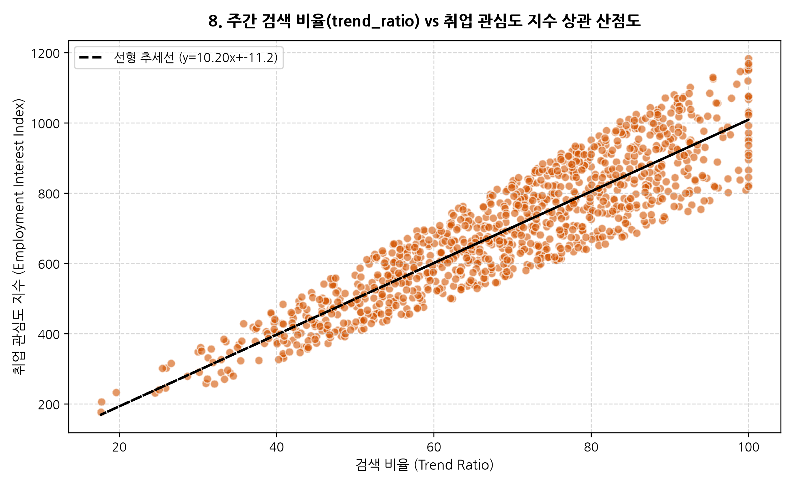
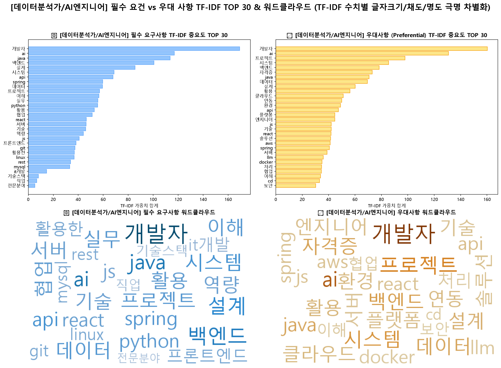
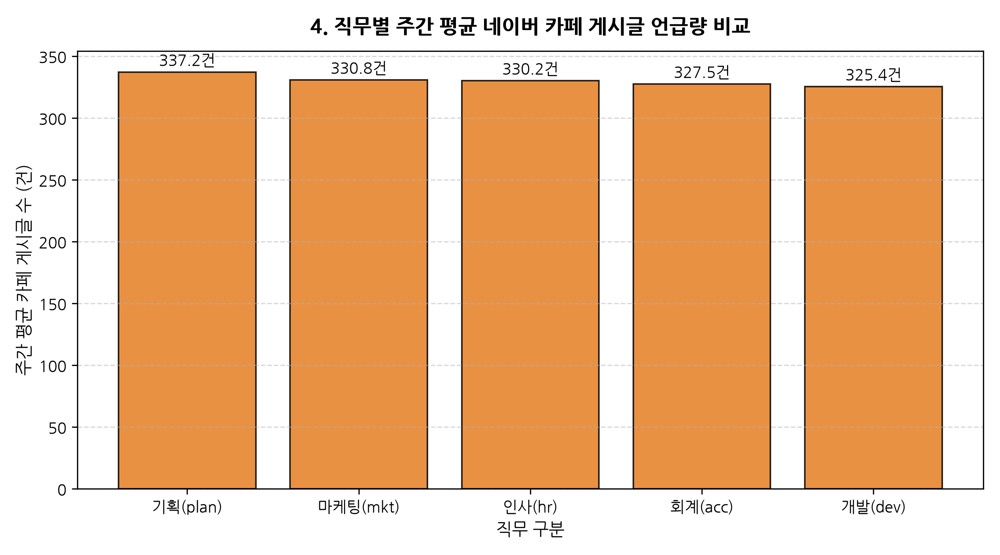
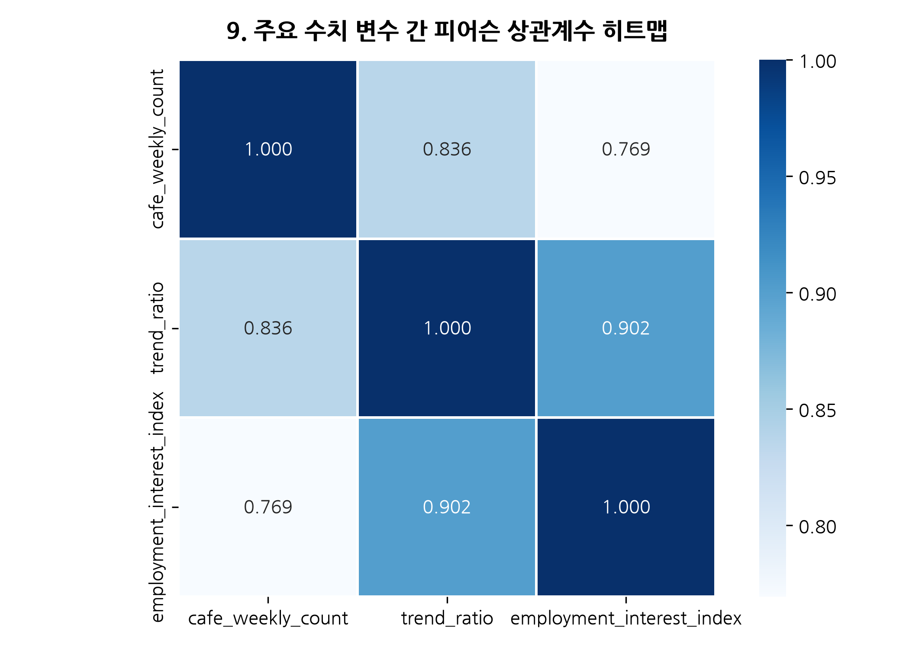

<!-- slide: 1 (Title Cover) -->
<!-- _header: '' -->
<!-- _footer: '' -->

  
✦ SOLVING THE JOB MARKET MISMATCH

  <h1>AI 기반 채용 시장 다차원 EDA & 직무 적합도 진단 대시보드</h1>
  
데이터 분석가 직무를 중심으로 살펴본 구직자-기업 간 '수급 미스매치' 해소 솔루션

  
⚡ 2026.07 | 👥 AI DATA ANALYSIS PORTFOLIO PRESENTATION

---

<!-- slide: 2 -->
# 1. 기획 동기: 채용 시장의 영원한 역설 (Motivation)

## "기업은 뽑을 사람이 없고, 구직자는 갈 곳이 없다"

🎯 <strong>문제 제기</strong>: 채용 시장에 데이터가 넘쳐남에도 불구하고, 구직자의 [보유 스펙]과 기업의 [요구 역량] 간의 극심한 '수급 미스매치(Mismatch)'가 발생하고 있습니다.

  

    <h3>🔍 데이터 분석가 직무의 현실</h3>
    <ul>
      <li><strong>기업의 고민</strong>: "ADsP 자격증 있는 지원자는 많은데, 실제 <code>SQL</code>로 실무 데이터를 추출하고 <code>Tableau</code>로 시각화할 수 있는 인재가 없다."</li>
      <li><strong>구직자의 고민</strong>: "데이터 분석가가 되려고 파이썬과 머신러닝을 공부했는데, 서류에서 계속 탈락한다. 도대체 무엇이 부족한지 모르겠다."</li>
    </ul>
  

  

    <h3>💡 솔루션의 필요성 대두</h3>
    
막연한 감이 아닌 <strong>실제 채용 공고(사람인)</strong>와 <strong>검색 트렌드(네이버)</strong> 데이터를 교차 분석하여, 미스매치의 간극을 정확히 진단하고 양측에 <strong>실질적인 액션 플랜</strong>을 제공하는 대시보드를 기획하게 되었습니다.

  

---

<!-- slide: 3 -->
# 2. EDA로 확인한 '데이터 분석가' 미스매치 현황

## 수요-공급 4분면 맵으로 포착한 블루오션과 레드오션

🎯 <strong>EDA 인사이트</strong>: 단순 빈도 분석이 아닌, [기업 요구(JD TF-IDF)] vs [구직자 관심도(Naver 검색량)]를 4분면으로 시각화하여 역량의 효율성을 검증했습니다.

  

    <h3>📊 스킬 수급 4분면 맵 분석 결과</h3>
    <ul>
      <li><strong>⚠️ 레드오션 (과공급)</strong>: <code>ADsP</code>, <code>파이썬 기초</code> (구직자 관심은 폭발적이나 기업의 변별력은 낮음 = 스펙 낭비 구역)</li>
      <li><strong>💎 블루오션 (공급부족)</strong>: <code>SQL</code>, <code>Tableau</code>, <code>A/B 테스트</code> (기업 수요는 높으나 구직자 관심은 저조함 = 전략적 공략 포인트)</li>
      <li>이러한 <strong>Gap(격차) 지표</strong>를 정량화하여 대시보드의 핵심 추천 알고리즘으로 차용했습니다.</li>
    </ul>
  

  

    <h3>🔥 데이터 분석가 수급 미스매치 인덱스</h3>
    

      
    

  

---

<!-- slide: 4 -->
# 3. User Scenario 1: 취준생 '김데이터' 님의 고민

## "도대체 무엇을 더 준비해야 데이터 분석가로 취업할 수 있을까?"

👤 <strong>페르소나</strong>: 김데이터 (26세, 취업준비생) / 보유 스펙: 토익 850, ADsP 자격증, 파이썬 부트캠프 수료

  

    <h3>🤔 김데이터 님의 Pain Point</h3>
    <ul>
      <li>남들이 다 따는 자격증(ADsP, 컴활)은 취득했지만 서류 합격률이 10% 미만입니다.</li>
      <li>최신 트렌드인 딥러닝(Deep Learning) 프로젝트를 준비해야 할지, 아니면 기본기에 충실해야 할지 우선순위를 정하지 못해 불안합니다.</li>
    </ul>
  

  

    <h3>✨ 대시보드 솔루션 ➔ [구직자 탭]</h3>
    
우리의 대시보드는 김데이터 님에게 <strong>"딥러닝보다는 SQL이 시급하다"</strong>는 객관적인 데이터 기반 피드백을 제공합니다.

  

---

<!-- slide: 5 -->
# 4. 해결책: [구직자 탭] 스펙 자가진단 및 맞춤 로드맵

## 5대 영역 적합도 스코어링 & 3단계 합격 로드맵 즉각 발급

🎯 <strong>기능 가치</strong>: 지원자의 스펙을 100점 만점으로 진단하고, 취업 확률을 가장 빠르게 높일 수 있는 "가성비 스펙"을 추천합니다.

  

    <h3>💡 김데이터 님의 진단 결과 및 처방</h3>
    <ul>
      <li><strong>5대 영역 스코어</strong>: <code>0.2*Tool + 0.2*Lic + ...</code> 수식을 통해 [툴/기술] 영역이 현저히 낮음을 시각적으로 확인.</li>
      <li><strong>부족 스펙 TOP 3 피드백</strong>: 막연한 조언 대신 <code>SQL</code>, <code>Tableau</code>, <code>Google Analytics</code>를 명시적으로 지적.</li>
      <li><strong>합격 로드맵</strong>: "당장 딥러닝보다는 프로그래머스 SQL 고득점 달성 후 이력서에 반영하세요."</li>
    </ul>
  

  

    <h3>📈 개인화된 미흡 역량 피드백</h3>
    

      
    

  

---

<!-- slide: 6 -->
# 5. User Scenario 2: 인사담당자 '이채용' 님의 고민

## "왜 우리 회사 데이터 분석가 채용 공고에는 허수 지원자만 많을까?"

👤 <strong>페르소나</strong>: 이채용 (34세, IT기업 인사팀장) / 고민: 채용 공고를 올려도 실무 투입 가능한 인재가 오지 않음

  

    <h3>🤔 이채용 님의 Pain Point</h3>
    <ul>
      <li>현업 부서의 요구사항을 그대로 복사해서 JD(채용 공고)에 올렸습니다. (예: "머신러닝 경험자 우대", "빅데이터 처리 우대")</li>
      <li>정작 실무에서 가장 중요한 '지표 설정(KPI)'이나 'A/B 테스트' 경험자는 지원하지 않고, 무관한 부트캠프 수료생만 지원하여 면접 리소스가 낭비됩니다.</li>
    </ul>
  

  

    <h3>✨ 대시보드 솔루션 ➔ [인사팀 탭]</h3>
    
우리의 대시보드는 이채용 님에게 <strong>공고의 문제점(Gap)을 진단하고 매력적인 JD로 리모델링</strong>하는 시뮬레이터를 제공합니다.

  

---

<!-- slide: 7 -->
# 6. 해결책: [인사팀 탭] 수급 Gap 분석 및 JD 최적화

## JD 리모델링 시뮬레이터를 통한 타겟 지원자 모객 최적화

🎯 <strong>기능 가치</strong>: 비효율적 공고(JD)를 데이터 기반으로 최적화하여 우수 인재 유치 시간과 비용을 절감합니다.

  

    <h3>💡 이채용 팀장의 공고 최적화 액션</h3>
    <ul>
      <li><strong>수급 Gap 진단</strong>: 현재 공고에 포함된 '머신러닝'은 구직자의 이목을 끌지 못함을 데이터로 확인.</li>
      <li><strong>JD 리모델링 시뮬레이터</strong>: 대시보드가 제안한 대로 "제품 데이터를 활용한 A/B 테스트 경험 우대" 및 "Tableau 대시보드 구축 경험 우대"로 JD 전면 수정.</li>
      <li><strong>결과</strong>: 허수 지원자가 줄고, 현업에서 즉시 필요로 하는 실무형 데이터 분석가 모객에 성공.</li>
    </ul>
  

  

    <h3>📈 Gap 차트를 통한 JD 취약점 도출</h3>
    

      
    

  

---

<!-- slide: 8 -->
# 7. 기저 아키텍처: 다차원 데이터 파이프라인

## 사람인(Saramin) 실측 공고와 네이버 Open API 여론의 결합

🎯 <strong>신뢰성의 원천</strong>: 이 모든 시나리오는 직무당 1,000건의 검증된 실측 데이터와 대중의 실시간 관심도를 교차 분석한 견고한 데이터 파이프라인 덕분입니다.

  

    <h3>🛠️ 데이터 수집 및 정제 시스템</h3>
    <ul>
      <li><strong>기업 수요 데이터 (사람인)</strong>: 아웃소싱/헤드헌팅을 배제한 순수 기업 공고 수집, 1:1 view-detail 검증으로 정합성 100% 확보.</li>
      <li><strong>구직자 여론 데이터 (네이버 API)</strong>: DataLab 트렌드 시계열 및 카페 게시글 TF-IDF 분석을 통한 실시간 '취업 스펙 관심도' 정량화.</li>
      <li><strong>실시간 동적 연동 (Streamlit)</strong>: 사이드바 직무 스위처를 통해 6대 직무(기획, 인사, 회계, 마케팅, 데이터 등) 전체로 확장 가능한 모듈형 아키텍처.</li>
    </ul>
  

  

    <h3>📈 데이터 건전성 자동 감지</h3>
    
실측 데이터 결실 시에도 <code>⚠️ [MOCK DATA]</code>로 자동 전환되어 시스템 중단 없이 안정적으로 가동됩니다.

    

      
    

  

---

<!-- slide: 9 -->
# 8. 거시적 마켓 인사이트: 학력/경력 분포 및 이직위험

## 신입 3% 제약과 상시 구인(악성 순환) 기업 필터링

🎯 <strong>거시적 컨텍스트</strong>: 개인의 스펙뿐 아니라, 고용 시장의 거시적 구조(문턱)와 기업의 고용 건전성을 투명하게 시각화합니다.

  

    <h3>🎓 학력/경력 구조적 제약</h3>
    
• <strong>데이터 분석가 신입 채용 3%</strong>: 대부분 최소 1~3년의 경력을 요구하므로, 취준생은 '중고 신입' 또는 '포트폴리오 중심' 전략이 필수임을 입증.

    
• <strong>대졸(4년제) 58%</strong>: 학력 문턱 현실을 데이터로 직시.

  

  

    <h3>📦 악성 순환(Toxic Interval) 박스플롯</h3>
    
• <strong>고용 건전성 평가</strong>: 10일 이내에 동일 공고를 계속 올리는 '상시 구인 소모전' 기업을 탐지하여, 구직자에게는 위험을 경고하고 기업에게는 채용 건전성 제고를 촉진.

  

---

<!-- slide: 10 -->
# 9. 결론 및 향후 고도화 계획 (To-Be Architecture)

## 정량 스펙 낭비 방지 + 채용 소모전 예방 = 차세대 HR Tech

🎯 <strong>최종 비전</strong>: 구직자와 인사팀 양방향의 페인포인트(Pain-point)를 모두 해결하여, 채용 시장의 정보 비대칭성을 해소하는 윈윈(Win-win) 솔루션입니다.

  

    <h3>🚀 향후 아키텍처 및 알고리즘 진화 (To-Be)</h3>
    <ul>
      <li><strong>⚙️ Data Eng</strong>: Airflow 배치 자동화로 일 단위 실시간 공고 트렌드 반영.</li>
      <li><strong>🤖 AI Modeling</strong>: 단순 텍스트 매칭(TF-IDF)을 넘어, SBERT(Sentence Transformer) 기반의 의미론적 매칭 도입으로 진단 정확도 200% 극대화.</li>
      <li><strong>✨ Premium UI/UX</strong>: Bento Grid 및 마이크로 인터랙션 UX/UI 전면 개편.</li>
    </ul>
  

  

    <h3>💡 핵심 변수 상관관계 히트맵 시각화</h3>
    

      
    

  

