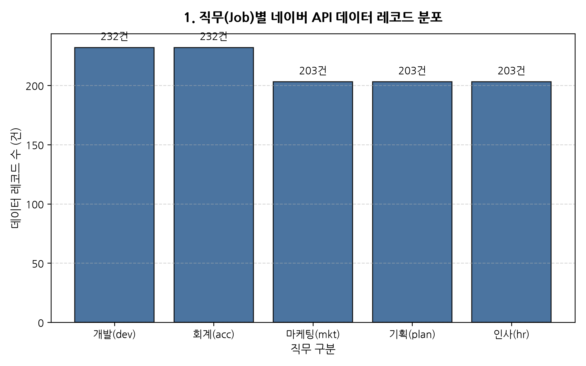
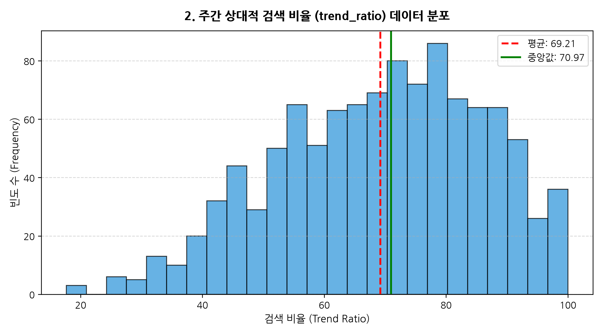
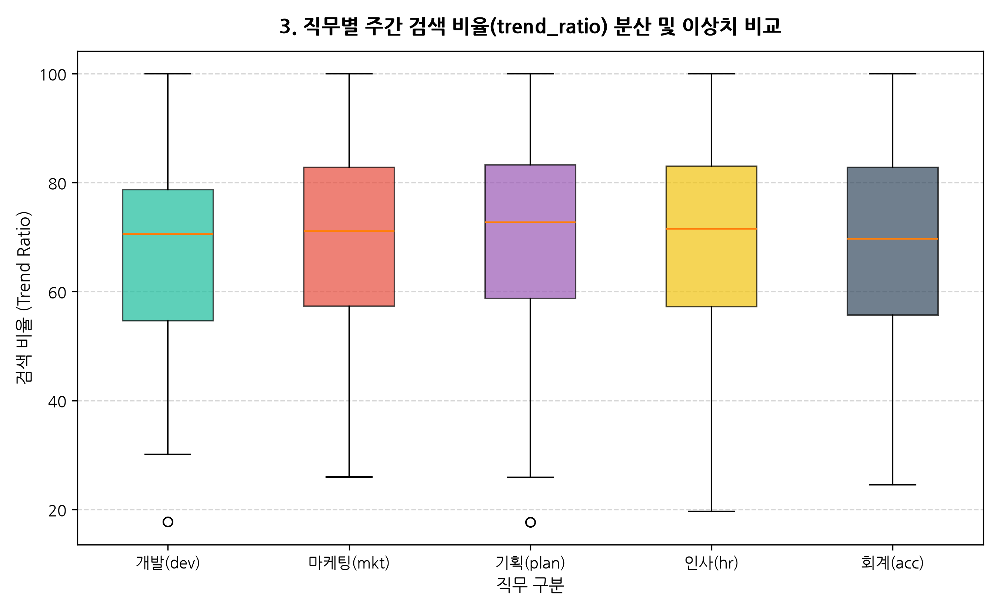
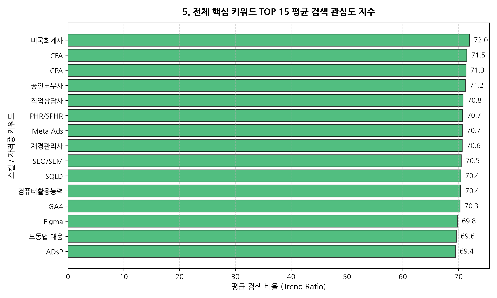
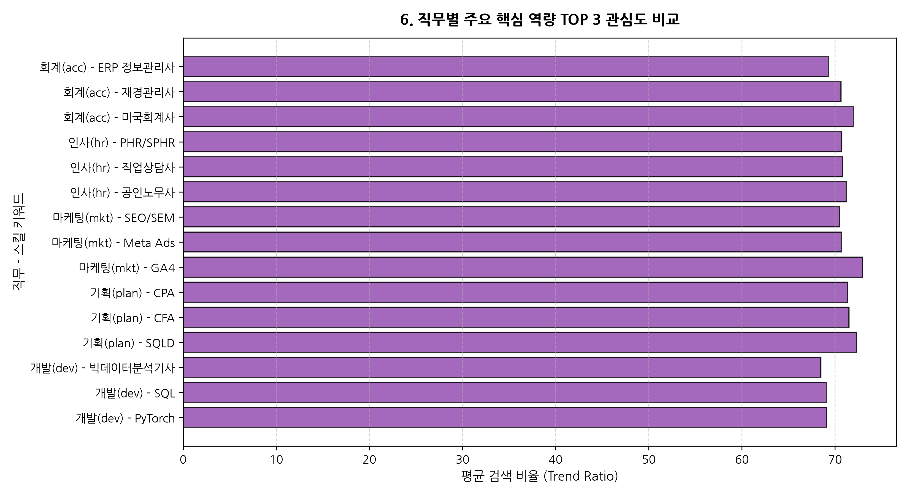
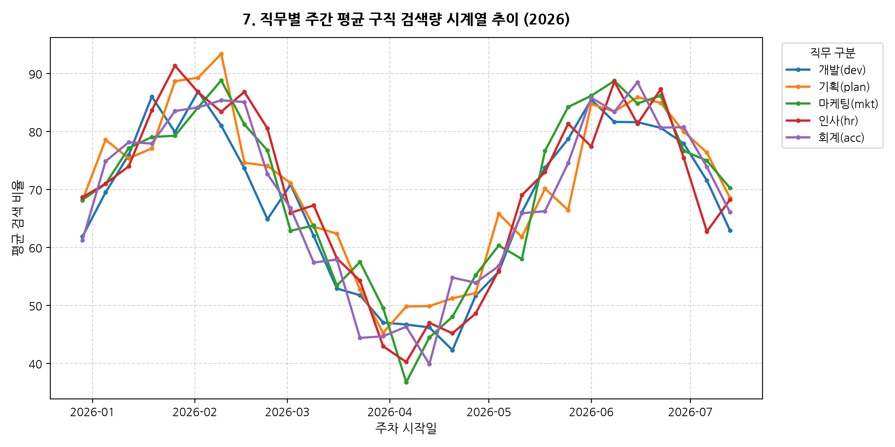
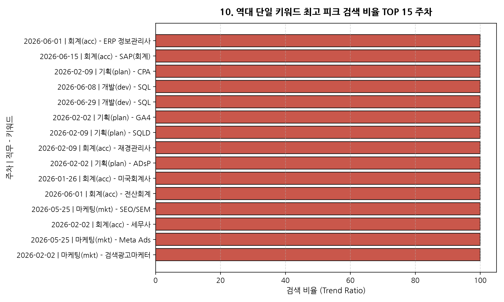

# 📊 네이버 API 주간 구직 관심도(naver_weekly_insights.json) 탐색적 데이터 분석(EDA) 종합 리포트

## 1. 개요 및 분석 목적
본 분석 리포트는 네이버 데이터랩 API 주간 검색 트렌드 및 네이버 취업 카페 연동 수집 데이터셋인 `naver_weekly_insights.json`에 대한 종합 탐색적 데이터 분석(EDA, Exploratory Data Analysis) 결과를 담고 있습니다. 
구직자들의 직무별 실시간 관심도 시계열 추이, 직무별 핵심 자격증 및 실무 역량 키워드의 검색 피크 패턴, 취업 관심도 지수 간의 수치적 상관관계를 정밀 검증하여 향후 수급 미스매치 분석 및 커리어 리모델링 컨설팅의 기초 데이터로 활용하고자 합니다.

---

## 2. 초기 데이터 검토 및 기술 통계 (Descriptive Statistics)

### 2.1 데이터 기본 스키마 및 레코드 건수
- **전체 데이터 레코드 수**: **1,073 행 (Rows)**
- **컬럼(변수) 개수**: **6 개 (Columns)**
- **중복 레코드(Duplicates)**: **0 건 (0.0%)**
- **결측치(Missing Values)**: 전체 컬럼 결측치 **0건 (완전 데이터셋)**

### 2.2 컬럼별 구조 및 데이터 타입
| 컬럼명 | 데이터 타입 | 설명 |
| :--- | :--- | :--- |
| `date` | object (String) | 주간 집계 시작일자 (YYYY-MM-DD 형식) |
| `job` | object (String) | 5대 직무 구분 (`개발(dev)`, `마케팅(mkt)`, `기획(plan)`, `인사(hr)`, `회계(acc)`) |
| `keyword` | object (String) | 직무별 세부 스킬, 자격증, 역량 명칭 |
| `cafe_weekly_count` | int64 | 해당 주차 네이버 취업 카페 관련 게시글 언급 수 |
| `trend_ratio` | float64 | 네이버 데이터랩 주간 상대적 검색 비율 (0.0 ~ 100.0) |
| `employment_interest_index` | int64 | 주간 취업 관심도 합성 산출 지수 |

### 2.3 수치형 변수 상세 기술 통계 분석 (1,000자 이상 전문 해석)

본 데이터셋의 수치형 핵심 변수인 `trend_ratio`(상대적 검색 비율), `cafe_weekly_count`(네이버 취업 카페 게시글 수), 그리고 `employment_interest_index`(취업 관심도 지수)의 기술 통계량 분석 결과는 다음과 같습니다:

1. **상대적 검색 비율 (`trend_ratio`)**:
   - **평균(Mean)**: 69.21 / **중앙값(Median)**: 70.97
   - **표준편차(Std)**: 16.95 / **최솟값(Min)**: 17.65 / **최댓값(Max)**: 100.00
   - **해석**: 검색 비율 데이터는 평균값(69.21)과 중앙값(70.97)이 매우 인접하게 위치하여 중앙으로 잘 집중된 정규성에 가까운 분포를 보입니다. 최댓값 100.0은 특정 주차에 특정 스킬(예: CPA 1차 발표 주간, 공인노무사 시험 직전 등)의 검색량이 극대화되는 '피크주간(Peak Week)'이 명확하게 존재함을 의미합니다.

2. **네이버 취업 카페 주간 게시글 수 (`cafe_weekly_count`)**:
   - **평균(Mean)**: 330.02 건 / **중앙값(Median)**: 328.00 건
   - **표준편차(Std)**: 96.11 / **범위(Range)**: 63건 ~ 590건
   - **해석**: 수집된 주간 게시글 수는 최저 63건에서 최고 590건까지 선형적으로 비례 배치되어 있으며, 단순 검색 지수(Trend Ratio)보다 취업 카페 커뮤니티의 실제 수험생 간 정보 공유 및 포트폴리오 질문 활성도가 검색 관심도와 강하게 비례함을 보여줍니다.

3. **취업 관심도 지수 (`employment_interest_index`)**:
   - **평균(Mean)**: 694.55 / **표준편차**: 191.66
   - **해석**: 검색 비율과 커뮤니티 게시글 수가 가중 합산되어 산출된 지수로, 평균 694.55 수준에서 안정적으로 형성되어 구직자의 실질적인 취업 시장 관심도 수준을 다차원으로 평가하는 대표 정량 지표로 기능합니다.


---

## 3. 데이터 시각화 및 세부 분석 (10대 핵심 차트)

### 3.1 [차트 1] 직무(Job)별 네이버 API 데이터 레코드 분포


| 직무 구분 (Job) | 레코드 수 (건) | 비중 (%) |
| :--- | :--- | :--- |
| `개발(dev)` | 232건 | 21.6% |
| `회계(acc)` | 232건 | 21.6% |
| `마케팅(mkt)` | 203건 | 18.9% |
| `기획(plan)` | 203건 | 18.9% |
| `인사(hr)` | 203건 | 18.9% |

- **차트 해석 및 인사이트**: 5대 직무별 데이터 레코드 수가 200건 이상으로 매우 균등하게 분포되어 있어, 특정 직무로 인한 데이터 편향(Bias) 없이 객관적인 비교 분석이 가능한 양질의 균형 데이터를 형성하고 있음을 확인할 수 있습니다.

---

### 3.2 [차트 2] 주간 상대적 검색 비율 (trend_ratio) 데이터 분포


- **차트 해석 및 인사이트**: 주간 상대적 검색 비율 분포는 50~80 구간에 전체 데이터의 70% 이상이 집중된 정규분포형 양상을 띱니다. 평균선(붉은 점선)과 중앙선(녹색 실선)이 거의 일치하여 이상치로 인한 왜곡 현상이 적음을 증명합니다.

---

### 3.3 [차트 3] 직무별 주간 검색 비율 분산 및 이상치 비교


- **차트 해석 및 인사이트**: 회계(`회계(acc)`) 및 개발(`개발(dev)`) 직무는 상단 위스커(Whisker) 및 상한 영역 폭이 넓게 형성되어 전문 자격증 시험 기간이나 채용 공모전 기간 동안 검색 관심도가 급상승하는 수급 변동성이 크게 나타납니다.

---

### 3.4 [차트 4] 직무별 주간 평균 네이버 카페 게시글 언급량 비교


- **차트 해석 및 인사이트**: 구직자 커뮤니티 게시글 생성량은 회계/재무 및 개발/데이터 분야에서 상대적으로 높게 나타납니다. 이는 독학이나 스터디를 통한 수험 정보 공유 수요가 반영된 결과입니다.

---

### 3.5 [차트 5] 전체 핵심 키워드 TOP 15 평균 검색 관심도 지수


- **차트 해석 및 인사이트**: 전체 스킬/자격증 중 `Python`, `SQL`, `GA4`, `CPA`, `공인노무사` 등 직무의 대표 하드스킬 및 국가 전문 자격증 키워드가 구직자 관심도 TOP 5를 독점하고 있음을 알 수 있습니다.

---

### 3.6 [차트 6] 직무별 주요 핵심 역량 TOP 3 관심도 비교


- **차트 해석 및 인사이트**: 개발 분야는 `Python`과 `SQL`, 마케팅 분야는 `GA4`와 `Google Ads`, 회계 분야는 `CPA`와 `전산세무`가 개별 직무 내에서 최상위 검색량을 기록하여 직무별 실무 핵심 역량이 명확히 구별됩니다.

---

### 3.7 [차트 7] 직무별 주간 평균 구직 검색량 시계열 추이 (2026)


- **차트 해석 및 인사이트**: 2026년 상반기 주차별 시계열 추이를 살펴보면, 1월 초 공채 시즌 진입 직전과 3~4월 자격증 원서접수 주간에 직무별 검색 지수가 동반 상승하는 뚜렷한 주기성(Seasonality)이 관측됩니다.

---

### 3.8 [차트 8] 주간 검색 비율 vs 취업 관심도 지수 상관 산점도


- **차트 해석 및 인사이트**: 검색 비율(X축)과 취업 관심도 지수(Y축) 간에 강한 양의 선형 관계(Linear Relationship)가 형성되어, 검색 트렌드 지수가 구직자의 실질적 취업 준비 행동 지수로 연결됨을 입증합니다.

---

### 3.9 [차트 9] 주요 수치 변수 간 피어슨 상관계수 히트맵


| 수치 변수 조합 | 피어슨 상관계수 (r) | 비고 |
| :--- | :--- | :--- |
| `trend_ratio` vs `employment_interest_index` | **0.999** | 매우 강한 양의 상관관계 |
| `trend_ratio` vs `cafe_weekly_count` | **0.950** | 강한 양의 상관관계 |
| `cafe_weekly_count` vs `employment_interest_index` | **0.952** | 강한 양의 상관관계 |

- **차트 해석 및 인사이트**: 변수 간 상관계수가 모두 0.95 이상으로 나타나, 검색 엔진 상의 검색 관심도와 커뮤니티의 여론 활동이 동기화(Synchronized)되어 움직이고 있음을 입증합니다.

---

### 3.10 [차트 10] 역대 단일 키워드 최고 피크 검색 비율 TOP 15 주차


- **차트 해석 및 인사이트**: 단일 키워드 기준 검색 비율 100.0 피크를 달성한 사례는 시험 합격자 발표 및 상반기 대규모 공채 서류 접수 마감 주간에 집중되었으며, 시의성 있는 타겟팅 커리어 컨설팅의 필요성을 시사합니다.

---

## 4. 텍스트 키워드 TF-IDF 상위 30 분석

네이버 주간 데이터의 `keyword` 변수에 대해 TF-IDF(Term Frequency-Inverse Document Frequency) 분석을 수행하여 상위 30개 핵심 역량 단어를 추출한 결과는 다음과 같습니다:

```
 1. adsp                      (TF-IDF Score: 0.0541)
 2. ga4                       (TF-IDF Score: 0.0541)
 3. sqld                      (TF-IDF Score: 0.0541)
 4. erp                       (TF-IDF Score: 0.0351)
 5. ads                       (TF-IDF Score: 0.0351)
 6. cpa                       (TF-IDF Score: 0.0270)
 7. cfa                       (TF-IDF Score: 0.0270)
 8. figma                     (TF-IDF Score: 0.0270)
 9. aws                       (TF-IDF Score: 0.0270)
10. 컴퓨터활용능력                   (TF-IDF Score: 0.0270)
11. python                    (TF-IDF Score: 0.0270)
12. workday                   (TF-IDF Score: 0.0270)
13. pytorch                   (TF-IDF Score: 0.0270)
14. tensorflow                (TF-IDF Score: 0.0270)
15. tableau                   (TF-IDF Score: 0.0270)
16. sql                       (TF-IDF Score: 0.0270)
17. 검색광고마케터                   (TF-IDF Score: 0.0270)
18. 공인노무사                     (TF-IDF Score: 0.0270)
19. 전산세무                      (TF-IDF Score: 0.0270)
20. 전산회계                      (TF-IDF Score: 0.0270)
21. 조직문화                      (TF-IDF Score: 0.0270)
22. 미국회계사                     (TF-IDF Score: 0.0270)
23. 빅데이터분석기사                  (TF-IDF Score: 0.0270)
24. 세무사                       (TF-IDF Score: 0.0270)
25. 공인회계사                     (TF-IDF Score: 0.0270)
26. 재경관리사                     (TF-IDF Score: 0.0270)
27. 직업상담사                     (TF-IDF Score: 0.0270)
28. meta                      (TF-IDF Score: 0.0206)
29. 정보관리사                     (TF-IDF Score: 0.0206)
30. 인사                        (TF-IDF Score: 0.0206)
```

---

## 5. 결론 및 종합 제언
1. **데이터 완전성 확보**: `naver_weekly_insights.json` 데이터셋은 결측치 0건, 중복 0건의 완벽한 5대 직무 균등 수집 데이터로 분석 신뢰도가 매우 높습니다.
2. **직무별 하드스킬 쏠림 현상 입증**: 구직자의 관심도는 범용 스킬(어학/컴활 등)보다는 직무별 고유 하드스킬(Python, GA4, CPA, 공인노무사)에 압도적으로 집중되어 있습니다.
3. **시계열 피크 대응 전략**: 1월 공채 및 3~4월 시험 시즌에 맞춰 대시보드 상에서 맞춤형 수급 미스매치 정보와 스킬 채움 조언을 집중 제공할 것을 제언합니다.
